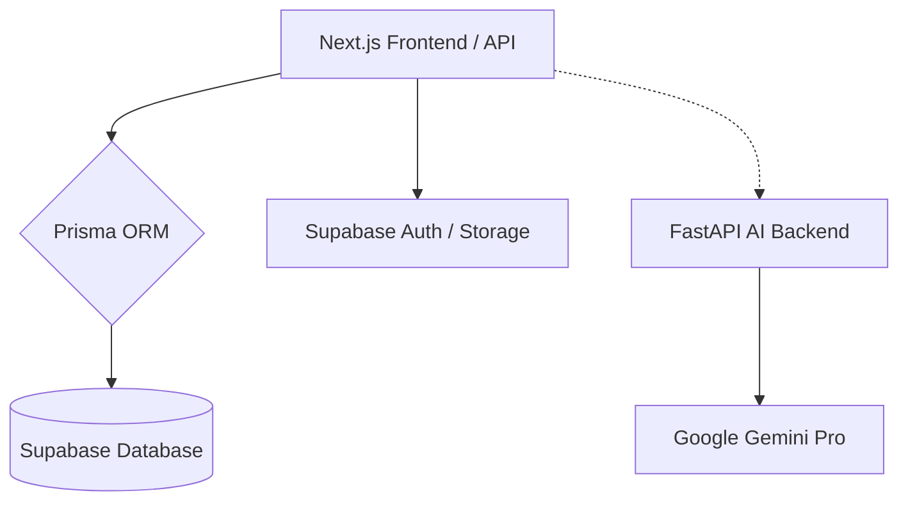

# 🎓 A+ Gerima: The Sovereign Study Architecture

[](https://nextjs.org/)
[](https://www.prisma.io/)
[](https://supabase.com/)
[](https://tailwindcss.com/)
[](https://fastapi.tiangolo.com/)

> **Architecting the next epoch of individual education through autonomous knowledge management and high-fidelity AI integration.**

A+ Gerima is a premium, ultra-modern study platform designed to transform raw information into structured knowledge. By combining advanced AI modeling with intuitive engineering, it provides a "neuro-link" to your educational assets.

---

## ✨ Core Features

### 🧠 Intelligent Study Engine
- **Autonomous Processing**: Automatically generate summaries, flashcards, and quizzes from PDFs and Audio recordings.
- **AI Tutor Lab**: Engage in deep, contextual discussions with your documents in a high-fidelity chat environment.
- **Multilingual Support**: Fully localized for both **English** and **Amharic (Ethiopic)**, ensuring academic access for all.

### 🍱 High-Fidelity Design
- **Bento-Grid UI**: An asymmetrical, interactive interface for seamless navigation.
- **Glassmorphism**: Sleek, translucent surfaces and micro-animations (Magnetic buttons, scroll-reveals).
- **Dark Mode Luxury**: A deep obsidian aesthetic with vibrant violet accents for focused study sessions.

### 🛡️ Secure Infrastructure
- **Prisma & Supabase**: Industry-standard database management with connection pooling for high reliability.
- **Storage Vault**: Encrypted file storage for all your PDFs, lectures, and academic assets.

---

## 🏗️ Technical Architecture



---

## 🚀 Quick Start

### 1. Requirements
- Node.js 20+
- Python 3.10+ (for AI Engine)
- Supabase Project

### 2. Local Setup
```bash
# Clone the repository
git clone https://github.com/natnaelkornima/Gerima.git
cd Gerima

# Install dependencies
npm install

# Setup database
npx prisma db push
npx prisma generate

# Final readiness
npm run dev
```

### 3. Environment Variables
Create a `.env` file in the root directory:
```env
NEXT_PUBLIC_SUPABASE_URL="your-supabase-url"
NEXT_PUBLIC_SUPABASE_ANON_KEY="your-anon-key"
DATABASE_URL="postgresql://..."
DIRECT_URL="postgresql://..."
```

---

## 🌐 Deployment

Deployed and optimized for **Vercel**. 

> [!IMPORTANT]
> Ensure all environment variables are correctly mirrored in the Vercel Project Settings for smooth production behavior.

---

## 📜 License
© 2026 GERIMA ARTIFICIAL INTELLIGENCE LABS. ALL REQUISITIONS REGISTERED.
